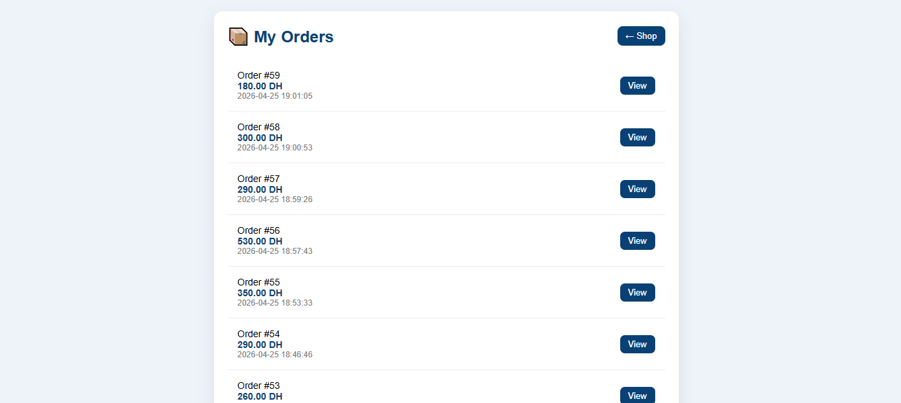
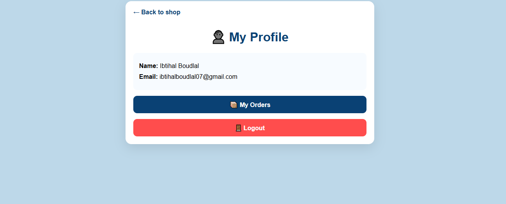
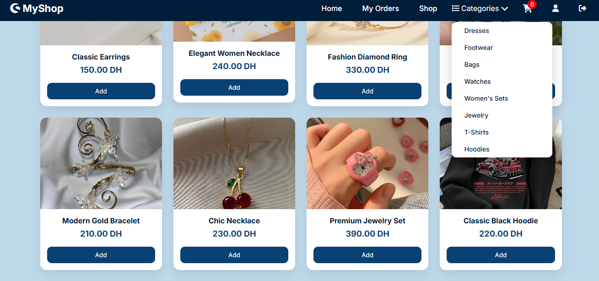

# 🛒 E-Commerce Website (PHP Project)

## 📌 Description
This is a simple e-commerce website developed using PHP and MySQL.

The project allows users to:
- Browse products
- Add products to cart
- Manage cart (add / remove / update quantity)
- Checkout and create orders
- View order history and order details
- Login system for users

---

## 🚀 Features

- User authentication (login / logout)
- Product listing from database
- Shopping cart (session-based)
- Checkout system
- Orders management
- Order details page
- Search products

---

## 🛠️ Technologies Used

- PHP (Backend)
- MySQL (Database)
- HTML
- CSS
- JavaScript
- PDO (Database connection)

---

### 🏠 Home Page

### 🛒 Cart Page

### 📦 Orders Page

### 📄 connection

### 🙍‍♀️ Profile

### 🛒 shop

---

## 👩‍💻 Author

- Name: Ibtihal Boudlal  
- Project: E-commerce Web Project  
